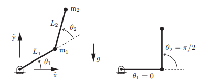

# Dynamics for arbitrary open chains

Following Modern Robotics ...

There's a worked example in the practice exercises, for 2R planar
in SE(3).



Here the mass is all at the ends of the links, to simplify the
math.

There are transformation matrices describing each link frame
in the zero configuration:

```math
M_1 = 
\begin{bmatrix}
1 & 0 & 0 & L_1 \\ 
0 & 1 & 0 & 0 \\ 
0 & 0 & 1 & 0 \\ 
0 & 0 & 0 & 1
\end{bmatrix}
,
M_2 = 
\begin{bmatrix}
1 & 0 & 0 & L_1+L_2 \\ 
0 & 1 & 0 & 0 \\ 
0 & 0 & 1 & 0 \\ 
0 & 0 & 0 & 1
\end{bmatrix}
```
And the transform from the first frame to the second:
```math
M_{12} = 
\begin{bmatrix}
1 & 0 & 0 & L_2 \\ 
0 & 1 & 0 & 0 \\ 
0 & 0 & 1 & 0 \\ 
0 & 0 & 0 & 1
\end{bmatrix}
```

There are screws for each axis (rotation-first here), first one is
just a rotation, second one is the twist at the end of the first
link.

```math
S_1 =
\begin{bmatrix}
0 \\
0 \\
1 \\
0 \\
0 \\
0
\end{bmatrix}
,
S_2 =
\begin{bmatrix}
0 \\
0 \\
1 \\
0 \\
-L_1 \\
0
\end{bmatrix}
```

To find these screws expressed in the link centers of mass,
$A_i$,
apply the adjoints of the inverses centers of mass transforms.

Given transform $T$,
```math
T =
\begin{bmatrix}
R & p \\
0 & 1
\end{bmatrix}
```
Remembering the definition of the adjoint:
```math
Ad_{x} =
\begin{bmatrix}
R & 0 \\
[p]_xR & R
\end{bmatrix}
```
where
```math
[p]_x =
\begin{bmatrix}
0 & -p_z & -p_y \\
p_z & 0 & -p_x \\
-p_y & p_x & 0
\end{bmatrix}
```

So

```math
Ad_{M_1^{-1}} =
\begin{bmatrix}
1 & 0 & 0 & 0 & 0 & 0 \\
0 & 1 & 0 & 0 & 0 & 0 \\
0 & 0 & 1 & 0 & 0 & 0 \\
0 & 0 & 0 & 1 & 0 & 0 \\
0 & 0 & L_1 & 0 & 1 & 0 \\
0 & -L_1 & 0 & 0 & 0 & 1 \\
\end{bmatrix}
```
```math
Ad_{M_2^{-1}} =
\begin{bmatrix}
1 & 0 & 0 & 0 & 0 & 0 \\
0 & 1 & 0 & 0 & 0 & 0 \\
0 & 0 & 1 & 0 & 0 & 0 \\
0 & 0 & 0 & 1 & 0 & 0 \\
0 & 0 & L_1+L_2 & 0 & 1 & 0 \\
0 & -L_1-L_2 & 0 & 0 & 0 & 1 \\
\end{bmatrix}
```
```math
A_1 =
Ad_{M_1^{-1}} S_1 = 
\begin{bmatrix}
0 \\
0 \\
1 \\
0 \\
L_1 \\
0
\end{bmatrix}
```
```math
A_2 =
Ad_{M_2^{-1}} S_2 = 
\begin{bmatrix}
0 \\
0 \\
1 \\
0 \\
L_2 \\
0
\end{bmatrix}
```
The gravity vector is 
```math
\mathbf{g} = 
\begin{bmatrix}
0 \\
g \\
0
\end{bmatrix}
```
where $g<0$.

Another way to express gravity is the acceleration of the
root, though here i think $g>0$.

```math
\dot{V}_0 =
\begin{bmatrix}
0 \\
0 \\
0 \\
0 \\
g \\
0
\end{bmatrix}
```

For each link, define the spatial inertia matrix $G_i$,
in the link reference frame, whose origin is at
the center of mass, so the inertia is zero:

```math
G_1 =
\begin{bmatrix}
0 & 0 & 0 & 0 & 0 & 0 \\
0 & 0 & 0 & 0 & 0 & 0 \\
0 & 0 & 0 & 0 & 0 & 0 \\
0 & 0 & 0 & m_1 & 0 & 0 \\
0 & 0 & 0 & 0 & m_1 & 0 \\
0 & 0 & 0 & 0 & 0 & m_1 \\
\end{bmatrix}
,
G_2 =
\begin{bmatrix}
0 & 0 & 0 & 0 & 0 & 0 \\
0 & 0 & 0 & 0 & 0 & 0 \\
0 & 0 & 0 & 0 & 0 & 0 \\
0 & 0 & 0 & m_2 & 0 & 0 \\
0 & 0 & 0 & 0 & m_2 & 0 \\
0 & 0 & 0 & 0 & 0 & m_2 \\
\end{bmatrix}

```


## References

* [Sola et al 2021](https://arxiv.org/pdf/1812.01537) Lie group theory, condensed and with robotics applications
* [Modern Robotics homepage](https://hades.mech.northwestern.edu/index.php/Modern_Robotics)}
* [Modern Robotics book](https://hades.mech.northwestern.edu/images/2/25/MR-v2.pdf)
* [Modern Robotics code](https://github.com/NxRLab/ModernRobotics) but no tests :(
* [RoboKitPy](https://github.com/foiegreis/RoboKitPy/tree/main) kinda the same, refactored a bit (still no tests)
* [Exercises including a 2R worked example](https://hades.mech.northwestern.edu/images/archive/0/00/20181130042048!ME449-practice.pdf)