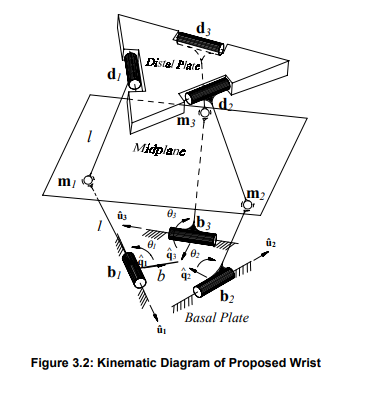
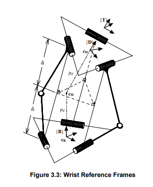

# Canfield joint kinematics
 
The Canfield joint is a parallel linkage that produces spherical angles
from three revolute joints.  It can produce 3d rotations with the
addition of a "roll" joint on the distal axis.

Since its discovery in 1997, it has not exactly taken the robotics world
by storm: real robots all still use serial 3R wrists, usually either
roll-pitch-roll, or pitch-roll-yaw.

It's interesting because it is without singularity and avoids twisting the
cabling between the plates.  For this reason, it's popular among space
researchers.





## Position Forward Kinematics

Following Canfield, chapter 3.

Midpoints:

```math
\mathbf{m}_i
=
\mathbf{R}_{[\hat{\mathbf{u}}, \theta_i]}
l
\hat{\mathbf{q}}_i
+
\mathbf{b}_i
\tag{3.1}
```

midplane coefficients:
```math
[A_m, B_m, C_m]^T
=
(\mathbf{m}_2 - \mathbf{m}_1)
\times
(\mathbf{m}_3 - \mathbf{m}_2)
\tag{3.2}
```


perpendicular distance from midplane to basal revolutes:
```math
\delta_i
=
\hat{\mathbf{N}}_m
\cdot
(\mathbf{m}_i - \mathbf{b}_i)
\tag{3.3}
```

midplane normal:
```math
\hat{\mathbf{N}}_m
=
\frac{[A_m, B_m, C_m]^T}
{\sqrt{A_m^2+B_m^2+C_m^2}}
\tag{3.4}
```

distal revolute points:
```math
\mathbf{d}_i
=
\mathbf{b}_i + 2 \delta_i \hat{\mathbf{N}}_m
\tag{3.5}
```

distal origin:
```math
\mathbf{c}_D
=
\frac{(\mathbf{d}_1 + \mathbf{d}_3 + \mathbf{d}_3)}{3}
\tag{3.6}
```

z axis:
```math
\hat{\mathbf{z}}_D
=
\frac{(\mathbf{d}_2-\mathbf{d}_1)\times(\mathbf{d}_3-\mathbf{d}_2)}
{|(\mathbf{d}_2-\mathbf{d}_1)\times(\mathbf{d}_3-\mathbf{d}_2)|}
\tag{3.7}
```

x axis:
```math
\hat{\mathbf{x}}_D
=
\frac{\mathbf{d}_1 - \mathbf{c}_T}{|\mathbf{d}_1 - \mathbf{c}_T|}
\tag{3.8}
```

y axis:
```math
\hat{\mathbf{y}}_D
=
-\hat{\mathbf{x}}_D
\times
\hat{\mathbf{z}}_D
\tag{3.9}
```

Distal frame rotation relative to base:

```math
{}_D^B \mathbf{R}
=
\left[
    \hat{\mathbf{x}}_D ,
    \hat{\mathbf{y}}_D ,
    \hat{\mathbf{z}}_D
    
\right]
\tag{3.10}
```

## Position inverse kinematics

The system of equations at 3.20 is to be "solved" for the Canfield 1997
method.  Instead, we can use the "constant plunge" method with simple
triangles.

TODO: finish that.

## References

* [Canfield 1997](https://vtechworks.lib.vt.edu/items/24e2f0e1-b8a4-44d3-b372-654556ffda1a) thesis
    * [Canfield 1997, chapter 3](https://vtechworks.lib.vt.edu/server/api/core/bitstreams/f73fec87-2f41-4180-a871-dee7b485356e/content) position kinematics


* [Bueno 2021](https://arxiv.org/pdf/2105.05955) kinematics paper
* [interactive geogebra solver](https://www.geogebra.org/m/jZq4byKJ)
* interesting [paper](https://web.stanford.edu/group/OTL/lagan/11496/file1.pdf) on an alternative, elevation/azimuth with a gear to prevent twisting.
* hilariously unfinished [nasa paper](https://ntrs.nasa.gov/api/citations/20220006350/downloads/Development_of_Canfield_Joint_as_a_Precision_Pointing_System_for_Deep_Space_Instrumentation.pdf)
* [Short, Hilton 2018](https://arxiv.org/pdf/1809.02148) nasa paper
* [Collins 2019](https://etd.ohiolink.edu/acprod/odb_etd/ws/send_file/send?accession=case1536104606070327&disposition=inline) MS thesis about canfield joints

Note quite a few of these references go into depth about failures,
partly because the Canfield joint is used by NASA (who care about
reliability) and partly because it has extra parts to break.