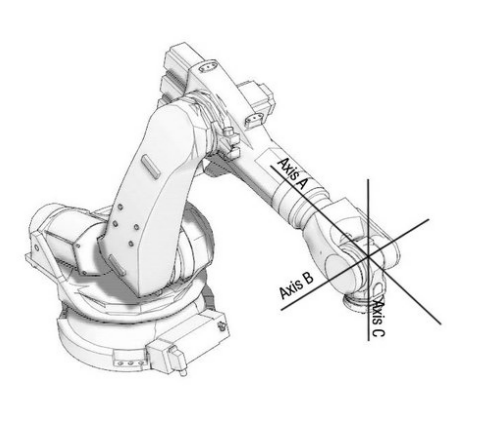

# 3R in SO(3)

A spherical linkage used for the "wrist" component of an arm.

The reasons to use a spherical wrist are that it involves
simple kinematics, and it can be made strong and light.

## Forward kinematics

The forward kinematics is simply a composition of transforms: the
"origins" rotate the axes appropriately, and the "joints" implement
the required rotation.

## Inverse kinematics

There is one singularity, when the roll axes are collinear.  In this state,
the *sum* of the roll axes is all that matters.

There is one symmetry, flipping the roll axis.  For example, to point the
tool straight up, from a horizontal arm, the roll axes can be zero, and
the pitch axis can tilt up (which is a positive angle in our chosen coordinates).
Another solution is for the roll axes to both be $\pi$, and for the pitch axis
to tilt in the opposite direction.

