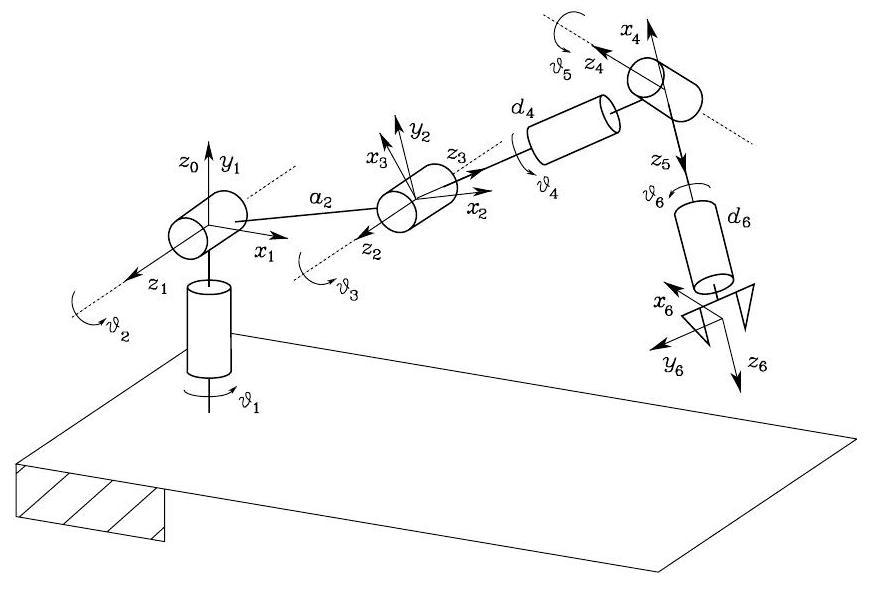
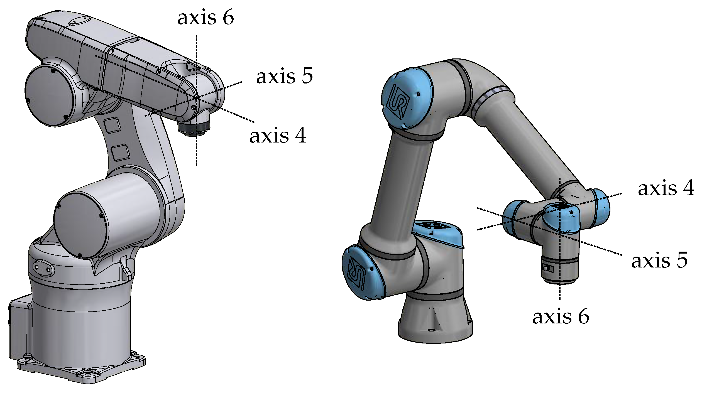
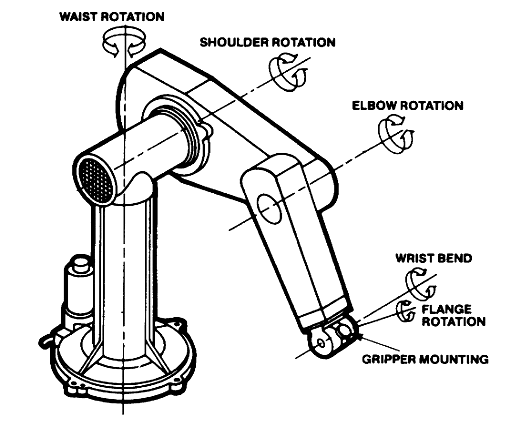

# Six-DOF Kinematics



Analytic kinematics for the common 6R linkage,
where the three wrist axes intersect, i.e. a
"spherical wrist".  The sequence of joint orientations
is "Y-P-P-R-P-R".

The spherical wrist (left) compared with an
offset design (right):


This design allows us to decouple the kinematics
problem into a "postional part", solving for the
translation of the wrist center, and an "orientation
part", solving for the rotation of the wrist.

A classic example of this design is the
["PUMA" arm](https://en.wikipedia.org/wiki/Programmable_Universal_Machine_for_Assembly):



## Forward position kinematics

The forward kinematics simply composes the joint transforms.

## Inverse position kinematics

For an end-effector pose $(\mathbf{t}, \mathbf{R})$:

First find the wrist position, by backing along the tool.  The
tool axis is z, so the tool vector $\mathbf{b}$ is:

```math
\mathbf{b} = l \cdot \mathbf{R} \cdot
\begin{bmatrix}
0\\0\\1
\end{bmatrix}
```

```math
\mathbf{w} = \mathbf{t} - \mathbf{b}
```

The positional kinematics of the first three joints, to the wrist origin,
can be solved as in the [RR case](../rr/README.md).

Given the solution for position, we can compute the rotation of
the wrist parent, ${}_0^3\mathbf{R}$

The desired rotation is the composition of the wrist parent and
the wrist joint:

```math
\mathbf{R} = {}_0^3\mathbf{R} {}_3^6\mathbf{R}
```
So we get the wrist rotation:
```math
{}_3^6\mathbf{R} =  {}_0^3\mathbf{R}^{-1} \mathbf{R}  

```
To decompose the wrist rotation into its RPR components

## References

* [Miranda 2017](https://ljvmiranda921.github.io/notebook/2017/01/25/forward-kinematics-stanford-manipulator/)
* [Kalaycioglu et al 2024](https://arxiv.org/pdf/2410.22582)
* [Addison 2020](https://automaticaddison.com/the-ultimate-guide-to-inverse-kinematics-for-6dof-robot-arms/)
* [Boschetti 2023](https://www.mdpi.com/2075-1702/11/2/306) comparing spherical and offset wrists; main insight is that q5 is limited to +/- pi/2 in the usual "spherical" design.
* [iris FK](https://wanxinjin.github.io/asu-robotics/lec6-8/fk.html)
* [iris IK](https://wanxinjin.github.io/asu-robotics/lec9/ik.html)